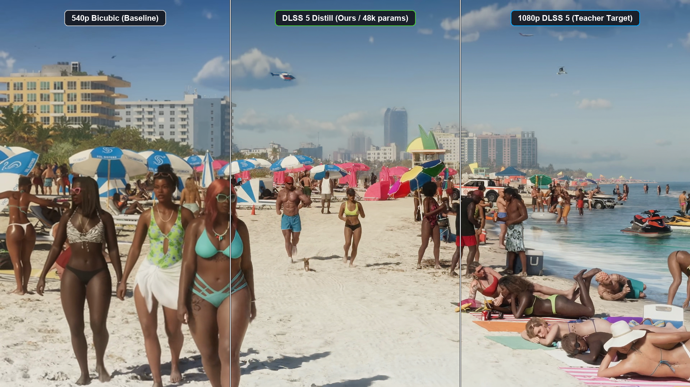

# dlss5-distill: Real-Time 2x Neural Super-Resolution via RepVGG Fusion & Anti-Ringing GAN Distillation

[](https://opensource.org/licenses/Apache-2.0)
[](https://pytorch.org/)
[-brightgreen.svg)]()

An ultra-compact (~48k parameter deployable) real-time 2x neural super-resolution model designed for edge devices, Apple Silicon Metal (MPS), and WebGPU. 

It leverages **Structural Re-Parameterization (RepVGG multi-branch training fused to a single 3x3 convolution)**, **Parameter-Free Spatial Attention**, and **Anti-Ringing Local-Range Penalty Distillation**.



---

### ⚠️ Disclaimer & Attribution
> **Notice**: This independent open-source research project has **NO affiliation, association, endorsement, or connection with NVIDIA Corporation**. "DLSS" is a registered trademark of NVIDIA Corporation. The naming `dlss5-distill` refers solely to experimental student distillation methodologies using publicly available high-resolution reference video trailers and game capture benchmarks as reconstruction targets. No proprietary NVIDIA code, binaries, SDKs, weights, or networks are used.

---

## ⚡ Architecture Highlights

1. **RepConv3x3Deployable (Structural Re-Parameterization)**:
   - **Training Mode**: 3 parallel branches (3x3 Conv + 1x1 Conv + Identity Skip) + PReLU activation.
   - **Inference Mode**: Mathematically fused into a single branchless 3x3 Conv2D kernel + bias. Drastically reduces GPU kernel launches and latency on unified memory architectures.
2. **RepGANBlock with Parameter-Free Spatial Attention**:
   - Feature enhancement using residual attention: $f_{att} = f \cdot \tanh(f)$.
3. **2x PixelShuffle Sub-Pixel Upscaler**:
   - Direct spatial sub-pixel reconstruction without heavy transposed convolution artifacts.
4. **Global Bicubic Bypass & Learnable Scale/Bias**:
   - Low frequencies bypass the deep trunk, letting the neural network specialize 100% on high-frequency edge restoration.
5. **Anti-Ringing Local-Range Penalty**:
   - Specifically penalizes overshoot and undershoot oscillations at contrast edges, eliminating ringing halos without blurring fine micro-textures.

---

## 📊 Model Specifications

| Parameter | Training Mode | Deploy (Fused) Mode |
| :--- | :--- | :--- |
| **Parameters** | ~94,500 | **~48,200** |
| **Input Resolution** | 960 × 540 (540p) | 960 × 540 (540p) |
| **Output Resolution**| 1920 × 1080 (1080p) | 1920 × 1080 (1080p) |
| **Inference Time (M1 Max MPS)** | ~22 ms | **~14 - 18 ms (45+ FPS)** |
| **Reconstruction PSNR** | — | **32.7 dB** |

---

## 🚀 Quickstart

### Installation

```bash
git clone https://github.com/Benjamin-Wegener/dlss5-distill.git
cd dlss5-distill
pip install torch torchvision pillow numpy
```

### Inference Example

```python
import torch
from PIL import Image
import numpy as np
from model import Phase4Generator

# 1. Load deployable model
device = torch.device("mps" if torch.backends.mps.is_available() else "cuda" if torch.cuda.is_available() else "cpu")
model = Phase4Generator(deploy=True).to(device)

checkpoint = torch.load("weights/model_dlss5_distill_deploy.pt", map_location="cpu")
model.load_state_dict(checkpoint)
model.eval()

# 2. Prepare 540p input image
img = Image.open("input_540p.png").convert("RGB")
inp = (torch.from_numpy(np.array(img)).permute(2, 0, 1).unsqueeze(0).float() / 255.0).to(device)

# 3. Super-resolve 2x to 1080p
with torch.no_grad():
    sr_tensor = model(inp)

# 4. Save result
sr_img = (sr_tensor[0].permute(1, 2, 0).cpu().numpy() * 255.0).clip(0, 255).astype(np.uint8)
Image.fromarray(sr_img).save("output_1080p.png")
print("Saved 1080p super-resolved image!")
```

---

## 🧪 Converting Training Weights to Fused Deploy Model

To fuse the multi-branch RepVGG kernels into single 3x3 convolutions:

```python
import torch
from model import Phase4Generator

# Load un-fused training checkpoint
model_train = Phase4Generator(deploy=False)
model_train.load_state_dict(torch.load("checkpoint_train.pt", map_location="cpu"))
model_train.eval()

# Mathematically collapse branches to single Conv2D
model_train.switch_to_deploy()

# Save fused weights
torch.save(model_train.state_dict(), "weights/model_dlss5_distill_deploy.pt")
print("Fused deploy model saved successfully!")
```

---

## 📄 License

Licensed under the **Apache License, Version 2.0**. See the [LICENSE](LICENSE) file for details.
